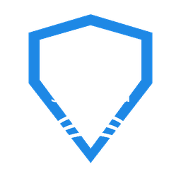

# IPRO SurGard
   
Кастомная интеграция для [Home Assistant](https://www.home-assistant.io) · версия **1.0.9**.

| | |
|---|---|
| Домен | `ipro_surgard` |
| Версия | 1.0.9 |
| Тип | custom integration |
## Описание
Приём событий Contact ID от панелей SurGard с сущностями охраны.
### Возможности
- Панель охраны (взять/снять)
- Бинарные датчики (движение, контакты и т.п.)
- Сенсоры и мониторинг состояния
### Установка
1. Скопируйте папку `custom_components/ipro_surgard/` в каталог `custom_components/` конфигурации Home Assistant.
2. Перезапустите Home Assistant.
3. Настройки → Устройства и службы → Добавить интеграцию → **IPRO SurGard**.
> Установка через HACS: добавьте репозиторий `https://github.com/bezuglyy/ipro_surgard` как Custom repository (категория Integration).
---
## Description
Contact ID events receiver from SurGard panels with alarm entities.
### Features
- Alarm control panel (arm/disarm)
- Binary sensors (motion, contacts, etc.)
- Sensors and state monitoring
### Installation
1. Copy the `custom_components/ipro_surgard/` folder into the `custom_components/` directory of your Home Assistant configuration.
2. Restart Home Assistant.
3. Settings → Devices & Services → Add Integration → **IPRO SurGard**.
> HACS: add `https://github.com/bezuglyy/ipro_surgard` as a Custom repository (category Integration).
---
**Автор / Author:**

## License / Лицензия
MIT
